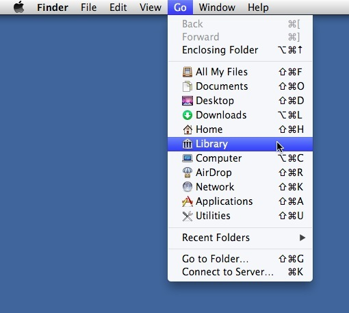
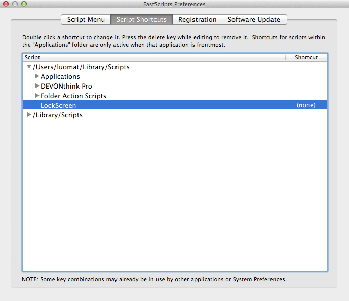

lockscreen
==========

Windows users who switch to the Mac often want an equivalent command to "Windows Key + L" which will automatically "lock" the screen of a Windows-based computer.

This can be easily replicated on a Mac *without* resorting to "hot corners" or anything like that.

All it takes is two things:

1. [FastScripts] which is free for up to 10 keyboard shortcuts
2. An AppleScript called [LockScreen.scpt]

The AppleScript executes one line:

		do shell script "/System/Library/CoreServices/Menu\\ Extras/User.menu/Contents/Resources/CGSession -suspend"

Note the *two* backslashes and the quotation marks.

## Installation ##

1) In Finder, click on the "Go" menu ***while holding down the Option/Alt key*** in order to reveal the otherwise-hidden "Library" option:

Then choose "Library"

2) Create a folder named "Scripts" in the Library folder.

3) Download [LockScreen.scpt] and put it into the "~/Library/Scripts/LockScreen.scpt" folder (Note: "~" is your home directory, sometimes referred to as "$HOME").

4) Download and install [FastScripts].

5) Launch FastScripts, open the Preferences (*hint:* FastScripts will appear in your menu bar at the top-right of your screen).

6) In FastScript preferences, select "Script Shortcuts" as shown here:

Double-click where it says "(none)" and you press whatever keyboard combination you want, as long as:

* It includes the command key <kbd>⌘</kbd> and at least one other key
* The combination is not in use by any other keyboard shortcut

For example, if you wanted to trigger the lock screen by <kbd>⌘</kbd> + <kbd>⌥</kbd> + <kbd>L</kbd> it should look like this

*Note:* I would recommend using <kbd>⌘</kbd> + <kbd>⌥</kbd> + <kbd>Shift</kbd> + <kbd>L</kbd>  since that is less likely to conflict with existing keyboard shortcuts, but it's up to you.

### "But I don't want to install a 3rd-party app to do this!" ###

Well, tough.

Yeah, I know Windows can do this without a 3rd-party app. How nice.

Supposedly you can do this with [Keychain Access] but I've never been able to get it to work, and ***at best*** it requires two different keystrokes.

Computers are no longer delicate little memory-starved quirkflowers which have to be coddled. 	If your computer can't handle FastScripts running in the background, it's time to shoot it and put it out of its misery.

### "But I want to turn the screen off ***and*** lock it!" ###

Download <http://tobiastom.github.io/Sleep-Display/>. Unzip it, and move "Sleep Display.app" to /Applications/.

Then use [SleepAndLockScreen.scpt](SleepAndLockScreen.scpt) which does this:

		ignoring application responses
			do shell script "/System/Library/CoreServices/Menu\\ Extras/User.menu/Contents/Resources/CGSession -suspend"
			tell application "Sleep Display" to activate
		end ignoring

[Keychain Access]: http://www.macworld.com/article/1049080/lockscreen.html

[FastScripts]: http://www.red-sweater.com/fastscripts/

[LockScreen.scpt]: LockScreen.scpt
